# 1.简介
复现论文中提出的方法：利用多目标优化问题的进化算法来解决经典增益调度问题，
并通过Pareto最优解集确保不同飞行条件过渡点的性能和稳定性。
## 1.1. Pareto
[Pareto 问题详解](https://blog.csdn.net/qq_40491534/article/details/120768346)
### 1.1.1.Pareto问题
Pareto最优解，也称为帕累托效率（Pareto efficiency），是指资源分配的一种理想状态，
假定固有的一群人和可分配的资源，从一种分配状态到另一种状态的变化中，
在没有使任何人境况变坏的前提下，使得至少一个人变得更好。
帕累托最优状态就是不可能再有更多的帕累托改进的余地；换句话说，帕累托改进是达到帕累托最优的路径和方法。
帕累托最优是公平与效率的“理想王国”。
 Pareto解 又称非支配解或不受支配解（nondominated solutions）如果对于一个决策变量，
不存在其他决策变量能够支配他，那么就称该决策变量为非支配解。 在有多个目标时，
由于存在目标之间的冲突和无法比较的现象，一个解在某个目标上是最好的，在其他的目标上可能是最差的。
这些在改进任何目标函数的同时，必然会削弱至少一个其他目标函数的解称为非支配解或Pareto解。
一组目标函数最优解的集合称为Pareto最优集。最优集在空间上形成的曲面称为Pareto前沿面。
Pareto 在1986 年提出多目标的解不受支配解(Non-dominated set)的概念，其定义为：
假设任何二解S1及S2对所有目标而言，S1均优于S2，则我们称S1 支配S2，若S1没有被其他解所支配，
则S1 称为非支配解（不受支配解），也称Pareto解。
### 1.1.2.Pareto Improvement
Pareto改进 (Pareto Improvement)是指一种变化，在没有使任何人境况变坏的前提下，
使得至少一个人变得更好。一方面，帕累托最优是指没有进行Pareto改进的余地的状态；
另一方面，Pareto改进是达到帕累托最优的路径和方法。
### 1.1.3.Pareto Front
Pareto解的集合即所谓的Pareto Front。在Pareto front中的所有解皆不受Pareto Front之外的解
（以及Pareto Front 曲线以内的其它解）所支配，因此这些非支配解较其他解而言拥有最少的目标冲突，
可提供决策者一个较佳的选择空间。在某个非支配解的基础上改进任何目标函数的同时，
必然会削弱至少一个其他目标函数。
### 1.1.4.Pareto最优解
假设两个目标函数，对于解A而言，在变量空间中找不到其他的解能够优于解A
（注意这里的优于一定要两个目标函数值都优于A对应的函数值），那么解A就是帕累托最优解，
举个例子，下图中应该找不到比x1 对应的目标函数都小的解了吧，即找不到一个解优于x1了，同理也找不到比x2
更优的解了，所以这两个解都是帕累托最优解，实际上，x1,x2 这个范围的解都是帕累托最优解。
因此对于多目标优化问题而言，帕累托最优解只是问题的一个可接受解，一般都存在多个帕累托最优解，
Pareto最优解是取得最贴合约束函数要求的范围值, 它并不唯一。
这个时候就需要人们自己决策了。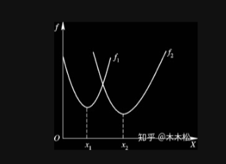
### 1.1.5.Pareto最优前沿
如下图所示，更好的理解一下帕累托最优解，实心点表示的解都是帕累托最优解，
所有的帕累托最优解构成帕累托最优解集，这些解经目标函数映射构成了该问题的Pareto最优前沿或Pareto前沿面，
即帕累托最优解对应的目标函数值就是帕累托最优前沿。
对于两个目标的问题，其Pareto最优前沿通常是条线。而对于多个目标，其Pareto最优前沿通常是一个超曲面。
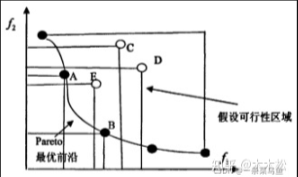
## 1.2 NSGA-Ⅱ
NSGA-II 算法的基本思想是：通过对种群的非支配排序达到对种群的分级，
计算种群个体的拥挤距离来保持种群的多样性，在达到终止条件时得到近似解。
- [NSGAⅡ](https://blog.csdn.net/weixin_44034444/article/details/119960596)
### 1.2.1.多目标优化的数学模型
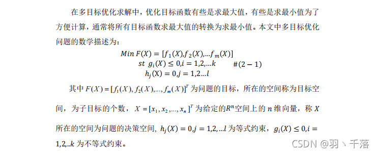
### 1.2.2.多目标优化的基本概念
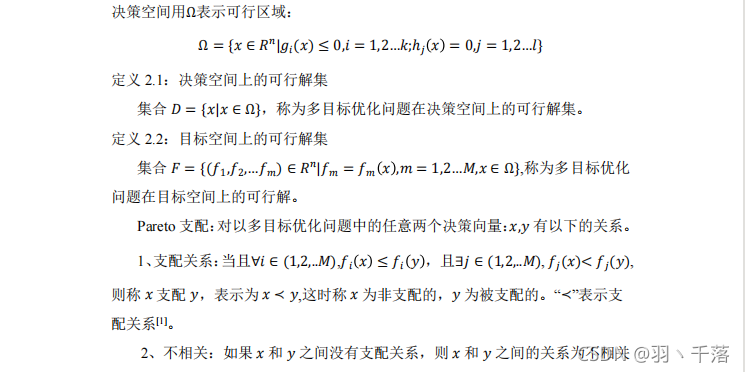
### 1.2.3.NSGA-Ⅱ算法的基本原理和框架
NSGA-II 算法的基本思想是：通过对种群的非支配排序达到对种群的分级， 
计算种群个体的拥挤距离来保持种群的多样性，在达到终止条件时得到近似解。 
- NSGA-II 算法的基本流程框架如下图：
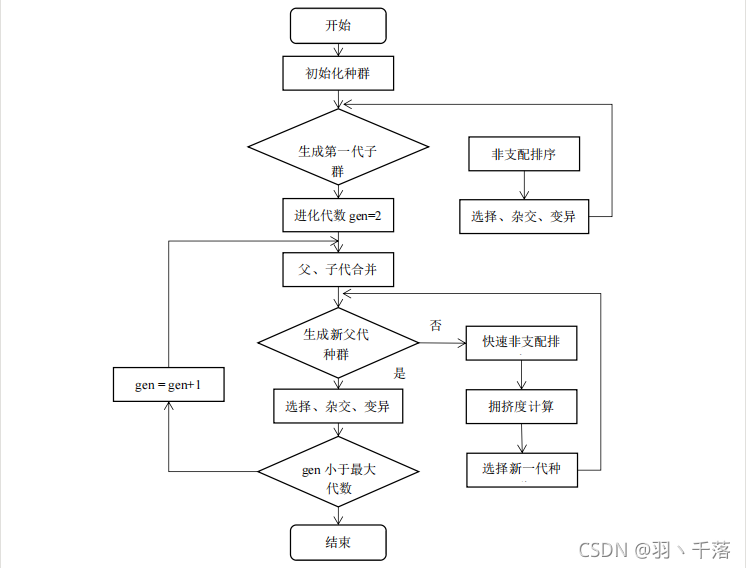
- 快速非支配排序算法
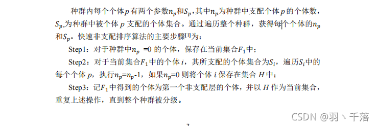
- 拥挤距离
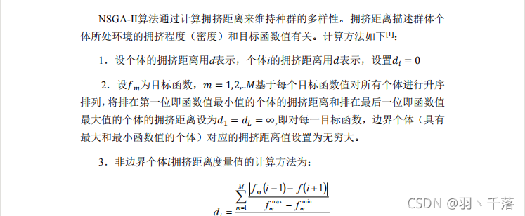
- 拥挤比较算子

- NSGA-Ⅱ的进化操作
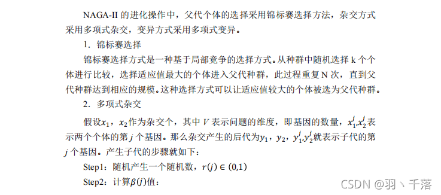
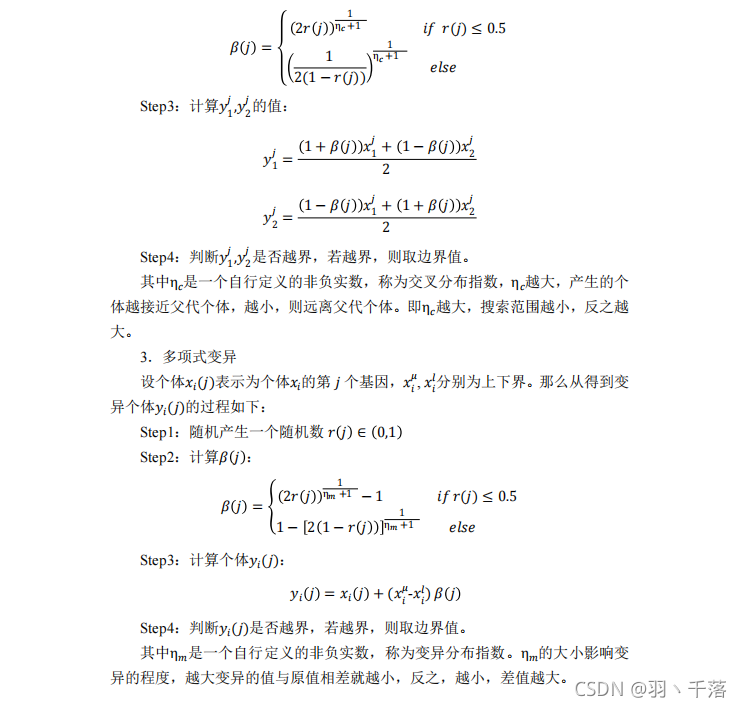
# 2.步骤
## 2.1.数据准备
### 2.1.1.飞行条件的定义
选定覆盖飞机飞行包线的一组飞行条件。
本文中选定了两个飞行条件：高度4000米和7000米，马赫数分别为0.567和0.77
### 2.1.2.系统的动态模型
获取飞机在这些飞行条件下的纵向动态模型，采用状态空间表示形式。
具体的状态空间矩阵可以参照本文的附录部分。
## 2.2.多目标优化问题的定义
### 2.2.1.性能指标
选定三个性能指标来评估闭环系统性能：
- 误差绝对值积分（IAE）
- 时间乘以平方误差积分（ITSE）
- 时间乘以绝对误差积分（ITAE）
### 2.2.2.数学模型
将多目标优化问题表示为以下形式：
 Minimize : F(x)=( f1(x) , ⋯.. fm(x))T , m = 1, 2, ⋯.M
其中，fi(x)表示不同的性能指标。
# 3.优化算法应用
## 3.1.非支配排序遗传算法（NSGA-Ⅱ）
# 4. 自动决策器
## 4.1.决策机制
实现自动决策器，根据当前飞行条件从Pareto最优解集中选择最佳解决方案。
## 4.2.参数调整
根据选择的最优解调整控制器参数，确保飞行条件之间的平滑过渡。
# 5.验证和评估
## 5.1.仿真验证
使用数值仿真验证所提出的增益调度控制方法在正常飞行条件和执行器失效情况下的有效性。
## 5.2.结果分析
通过比较不同飞行条件下的过渡稳定性和性能，评估优化结果的质量。
# 6.论文详解
## 6.1 step1：多目标问题-数学模型
第一步是建立多目标搜索方法的数学模型。一般来说，有四种搜索方法来寻找Pareto前沿近似解，
它们根据多目标优化问题的构造方法不同而不同。

dominance-based基于支配, decomposition-based基于分解,
metric-driven度量驱动, and hybrid approximation schemes混合近似方案 

然而，构造多目标问题的最经典的应用方法是基于支配的方法，公式如下：
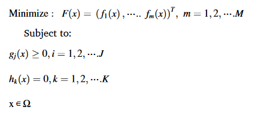

其中，M、J、K分别为相互冲突的目标函数、不等式和等式约束的个数。Ω是变量空间。

本文将经典的基于支配关系的方法应用于搜索Pareto前沿的近似解：
J_Dominance = [j1,...,jm]T

式中：j1,...,jm是一组目标函数，应使其最小化或最大化以获得一组非支配解。

此外，本文还提出了一种新的基于偏好的混合方法，以提高Pareto前沿的性能，从而实现高效的控制系统。
所提出的方法是基于对基于经典支配方法建立的多目标问题引入额外的权重因子而提出的。
所提出的方法表述如下:JProposed hybrid method=
[β1×J1  β2×J2]T

其中β1和β2是目标集(β1,β2<1)的随机权重。 添加这些偏好以获得良好的Pareto前沿的概念依赖于在当前飞行条件下对目标函数添加更多的惩罚。

在这项研究中，研究了代表闭环系统性能标准的三种不同的目标函数，以估计Pareto前沿，从而根据飞行条件估计所提出的增益调度控制器的参数。这3个误差性能指标都与最小化真实动力学与广义动力学之间的误差有关。此外，选取了两种飞行条件对所提出的方法进行了评估。
### 6.1.1目标函数
第1个定量准则描述了误差绝对值( IAE )指标的积分：

J_Dominance = [IAE1 IAE2]T

JProposed hybrid method=
[β1×IAE1  β2×IAE2]T

第2个性能指标反映了闭环系统的时间乘平方误差(ITSE)的积分，用于计算非支配最优解：

J_Dominance = [ITSE1 ITSE2]T

JProposed hybrid method=
[β1×ITSE1  β2×ITSE2]T

最后，考虑时间乘以绝对误差(ITAE)性能指标，得到Pareto前沿近似：

J_Dominance = [ITAE1 ITAE2]T

JProposed hybrid method=
[β1×ITAE1  β2×ITAE2]T

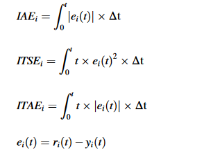

其中ei(t)为要求输出与实际输出之间的误差信号，Δt=0.01(sec)，t=10(sec)。

Pareto-front的质量可以通过解的收敛性、容量和多样性等多种特征来衡量。帕累托前沿的质量是指存在大量非支配解，即解的容量大，覆盖解多，解集间发散程度大。在这个问题中，根据以前的特征，所有Pareto有效解集的质量根据优化算法的类型而不同，Ma et al . ( 2022 )提出了一种新的算法来提高基于分解结构的大规模多目标和高维多目标优化问题的解的质量。
## 6.2 step2 优化过程
在本文中，两种基于进化的优化器称为快速排序和精英多目标遗传算法Ⅱ(NSGA.Ⅱ)和子种群遗传算法.Ⅱ(SPGA.II)被用来获得非支配最优解。NSGA.II算法已在多个基准问题上证明了其作为最佳多目标优化算法之一的有效性。NSGA.Ⅱ的优势表示如下：
- 利用非支配排序技术来获得尽可能接近Pareto最优解
- 采用拥挤距离技术来保证解的多样性
- 使用的搜索技术优于其他算法，因此它在下一代中保留了当前种群的最佳解决方案。
## 6.3 step3 自主决策机
自主决策机通过检测飞机当前的飞行状态来调整控制器的参数，以保证飞机在平衡点之间的平稳过渡。

一般来说，这个过程可以通过使用不同的方法来实现，例如先验偏好方法，该方法基于在优化过程之前选择解的感兴趣区域，该区域对应于设计者事先可以建立的一组不可更改的偏好。加权和问题构造方法是先验方法的一个例子。这种方法的主要缺点是无法容纳任何未知的不确定性和干扰。决策者的决策过程也可以用后验的方法来实现。在这种情况下，设计者可以在优化过程后选择最佳方案。此外，递进方法是基于改变优化过程中的偏好或搜索pareto-front.

在本论文中主要依赖于一种新的选择算法的后验偏好方法。因此，从第二步完成的解集合中选出一个解，然后根据飞行条件植入增益调度控制器。因此，所提出的自主决策- Maker算法背后的思想可以详细说明如下：
1. 根据目标函数(IAE、ITAE和ITSE)的值，将第二步(非支配最优解)中得到的解集重新排列成两组，如下方程所示。第一组与一组可行解有关，这些可行解可以保证飞行状态1下闭环系统的稳定性，当飞行状态1的性能指标小于飞行状态2的性能指标时，这些可行解表示为Pareto前沿上的所有解；当飞行状态2的性能指标大于飞行状态1的性能指标时，这些可行解表示为Pareto前沿上的所有解。
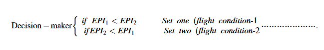式中：EPI为误差性能指标( IAE、ITAE和ITSE)。
2. 综合考虑以上2个集合，第1类集合的最低值可以选出第1种飞行状态的最优解，而第2类集合的最低值则代表第2种飞行状态的最优解
3. 因此，当飞机处于飞行状态一时，对应于上一步得到的设定状态一的最小值的增益被植入到增益调度控制器中。

所提出的决策者方法在实现最优解方面的成功取决于在保持多目标优化( MOO )方法优点的同时减少目标空间。
## 6.4 飞行器动力学与2-DOF-PID增益调度控制器
所提出的增益调度方法适用于B747飞机，考虑了两种飞行条件：飞行高度为4000 ~ 7000 m，马赫数为0.565 ~ 0.7，真实速度为150 ~ 250 m / s。因此，动态系统的状态空间表示可以表示为：
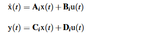

式中，Ai∊Rn×n,Bi∊Rn×m,Ci∊Rp×n, y(t) ∊ Rp×1, x(t) ∊ Rn×1, u(t) ∊ Rm×1分别为系统、输入输出矩阵、输出向量、状态向量、输入或控制向量。
Ai、Bi、Ci和Di矩阵随着飞行条件的变化而变化，如附录1所述。纵向状态向量、控制向量和输出向量可以定义为x = [ α qV TAS θ he]T，u = [ δa δe ] T，y = [ γaθqVh e]T其中，状态为攻角α ( rad )、俯仰角速率q ( rad / s )、真实速度VTAS ( m / s )、俯仰角θ ( rad )和高度he ( m )。有2个控制输入，稳定器挠度δ a ( rad )和升降舵挠度δ e ( rad )。可用的测量值有飞行航迹角γ ( rad )、飞机加速度̇ V ( m / s2 )、俯仰角θ ( rad )、俯仰速率q ( rad / s )、速度V ( m / s )、高度he ( m )。

本文采用二自由度PID ( 2 - DOF PID)控制器设计了所提出的增益调度方法。二自由度PID控制器的控制信号由下式给出：

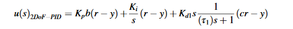

其中Kp，Ki，Kd，τ，b，c分别为比例增益、积分增益、导数增益、滤波器调节参数、积分器、比例项上的设定值权重和导数项上的设定值权重。以表1所示的参数为准。
另外，对β考虑3个随机取值：若β 1 < β2，则表明对飞行条件一的惩罚大于飞行条件二，反之亦然。因此，混合提出的方法通过增加以下约束来建立，以确保更多的质量Preto - front。例如，对于β 1，β 2分别等于0.3，0.1。
